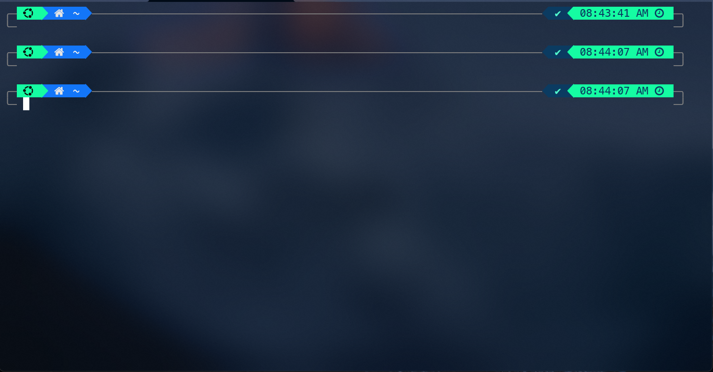

## Enable Right Prompt

_According to the starship documentation_
The Ble.sh framework v0.4 or higher should be installed in order to use right prompt in bash.

## Theme

Here I have used the coolnight Theme for the starship prompt.
Thanks to the Original creator of the theme. [Josean Martinez](https://github.com/josean-dev/dev-environment-files) check out his repo for more cool stuff.
And also I would like to thanks to [Jess Wang](https://github.com/theRubberDuckiee/dev-environment-files) for the edited version of coolnight theme. Also check out her repo.

aman testing
